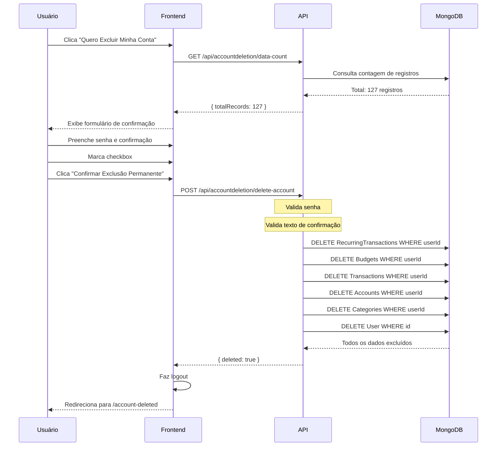

# ?? Exclusão Completa de Conta - LGPD Compliance

## ? **Recurso Implementado**

Sistema completo de exclusão de conta do usuário em conformidade com a **LGPD (Lei Geral de Proteção de Dados)**, implementando o **direito ao esquecimento**.

---

## ?? **O que foi Implementado**

### **1. Backend (API)**

#### **Serviço de Exclusão (`AccountDeletionService`)**
- ? Valida senha do usuário antes da exclusão
- ? Deleta **todos** os dados do usuário em cascata:
  - Transações Recorrentes
  - Orçamentos
  - Transações
  - Contas
  - Categorias
  - Perfil do Usuário
- ? Retorna contagem de registros antes da exclusão
- ? Tratamento de erros robusto

#### **Controller (`AccountDeletionController`)**
- ? **GET** `/api/accountdeletion/data-count` - Obtém quantidade de dados
- ? **POST** `/api/accountdeletion/delete-account` - Executa exclusão

#### **DTO de Requisição**
```csharp
public class DeleteAccountRequestDto
{
    public string Password { get; set; }
    public string ConfirmationText { get; set; } // "DELETAR MINHA CONTA"
}
```

---

### **2. Frontend (Blazor WebAssembly)**

#### **Página de Perfil Atualizada**
- ? Nova seção "Zona de Perigo" (card vermelho)
- ? Lista de todos os dados que serão excluídos
- ? Confirmação em múltiplas etapas:
  1. Botão inicial "Quero Excluir Minha Conta"
  2. Exibição da quantidade de registros
  3. Campo de senha
  4. Campo de confirmação (texto exato: "DELETAR MINHA CONTA")
  5. Checkbox de entendimento das consequências
  6. Botão final de confirmação

#### **Página de Confirmação (`AccountDeleted.razor`)**
- ? Mensagem de sucesso após exclusão
- ? Informação sobre conformidade LGPD
- ? Opções para criar nova conta ou fazer login

---

## ?? **Medidas de Segurança**

### **Proteção Contra Exclusões Acidentais:**

1. **Verificação de Senha**
   - Usuário deve confirmar com sua senha atual
   - BCrypt valida a senha no backend

2. **Texto de Confirmação**
   - Usuário deve digitar exatamente: `DELETAR MINHA CONTA`
   - Previne exclusão por erro de digitação

3. **Checkbox de Confirmação**
   - Declaração de entendimento das consequências
   - Botão só é habilitado quando todos os requisitos são atendidos

4. **Visual de Alerta**
   - Card vermelho com ícone de alerta
   - Texto em vermelho e negrito: "IRREVERSÍVEL"
   - Lista clara de todos os dados que serão excluídos

---

## ?? **Fluxo de Exclusão**



---

## ?? **Dados Excluídos**

Quando o usuário confirma a exclusão, os seguintes dados são **permanentemente removidos**:

| Tipo de Dado | Descrição |
|--------------|-----------|
| **Transações Recorrentes** | Todas as despesas/receitas configuradas como recorrentes |
| **Orçamentos** | Todos os orçamentos mensais criados |
| **Transações** | Histórico completo de receitas e despesas |
| **Contas** | Contas bancárias, carteiras, cartões de crédito, investimentos |
| **Categorias** | Categorias personalizadas criadas pelo usuário |
| **Perfil** | Dados pessoais, foto, telefone, email |
| **Configurações** | Preferências e configurações do usuário |

**Total estimado:** Varia conforme o uso, pode ser de centenas a milhares de registros.

---

## ?? **Interface do Usuário**

### **Seção "Zona de Perigo" na Página de Perfil**

```
????????????????????????????????????????????????????????????
? ?? Zona de Perigo                                        ?
????????????????????????????????????????????????????????????
?                                                           ?
? Excluir Conta Permanentemente                            ?
?                                                           ?
? Esta ação é IRREVERSÍVEL. Todos os seus dados serão      ?
? permanentemente excluídos, incluindo:                     ?
?                                                           ?
? • Todas as suas contas e saldos                          ?
? • Todas as transações registradas                        ?
? • Todas as categorias personalizadas                     ?
? • Todos os orçamentos criados                            ?
? • Todas as transações recorrentes                        ?
? • Seu perfil e configurações                             ?
?                                                           ?
? [Quero Excluir Minha Conta]                             ?
?                                                           ?
????????????????????????????????????????????????????????????
```

### **Formulário de Confirmação**

```
????????????????????????????????????????????????????????????
? ?? Confirmação de Exclusão                               ?
????????????????????????????????????????????????????????????
?                                                           ?
? Esta ação NÃO pode ser desfeita!                         ?
?                                                           ?
? Você possui 127 registros que serão permanentemente      ?
? excluídos.                                               ?
?                                                           ?
? Digite sua senha para continuar:                         ?
? [____________________________________________]            ?
?                                                           ?
? Digite exatamente "DELETAR MINHA CONTA" para confirmar: ?
? [____________________________________________]            ?
?                                                           ?
? ? Eu entendo que esta ação é permanente e todos os      ?
?   meus dados serão excluídos                             ?
?                                                           ?
? [??? Confirmar Exclusão Permanente] [? Cancelar]        ?
?                                                           ?
????????????????????????????????????????????????????????????
```

---

## ?? **Conformidade com LGPD**

### **Artigos Atendidos:**

? **Art. 18, VI** - Direito à eliminação dos dados pessoais tratados

> "É assegurado ao titular, mediante requisição ao controlador, o direito de obter do controlador, em relação aos dados do titular por ele tratados, a imediato: VI - eliminação dos dados pessoais tratados com o consentimento do titular..."

? **Art. 16** - Eliminação dos dados tratados com consentimento

> "Os dados pessoais serão eliminados após o término de seu tratamento..."

### **Garantias Implementadas:**

1. ? **Exclusão Completa e Permanente**
   - Todos os dados pessoais são removidos do banco de dados
   - Não há cópia, backup ou retenção dos dados

2. ? **Confirmação do Titular**
   - Múltiplos níveis de confirmação
   - Verificação de identidade via senha

3. ? **Transparência**
   - Usuário é informado exatamente quais dados serão excluídos
   - Contagem precisa de registros afetados

4. ? **Irreversibilidade**
   - Aviso claro de que a ação não pode ser desfeita
   - Não há período de "recuperação" dos dados

---

## ?? **Como Testar**

### **1. Acesse a Página de Perfil**
```
https://money-manager-web-production.up.railway.app/profile
```

### **2. Role até o final da página**
Procure pela seção "Zona de Perigo" (card vermelho)

### **3. Clique em "Quero Excluir Minha Conta"**
O sistema irá:
- Consultar quantos registros você possui
- Exibir o formulário de confirmação

### **4. Preencha o Formulário**
- Digite sua senha
- Digite: `DELETAR MINHA CONTA` (exato)
- Marque o checkbox de confirmação

### **5. Confirme a Exclusão**
- Clique em "Confirmar Exclusão Permanente"
- Aguarde o processamento (pode levar alguns segundos)

### **6. Você será redirecionado**
- Para a página de confirmação `/account-deleted`
- Com mensagem de sucesso e opções para criar nova conta

---

## ?? **Arquivos Criados/Modificados**

### **Backend (API)**
```
src/MoneyManager.Application/
  ??? DTOs/Request/
  ?   ??? DeleteAccountRequestDto.cs           ? NOVO
  ??? Services/
      ??? AccountDeletionService.cs            ? NOVO

src/MoneyManager.Presentation/
  ??? Controllers/
  ?   ??? AccountDeletionController.cs         ? NOVO
  ??? Program.cs                               ?? MODIFICADO
```

### **Frontend (Blazor)**
```
src/MoneyManager.Web/
  ??? Pages/
  ?   ??? Profile.razor                        ?? MODIFICADO
  ?   ??? AccountDeleted.razor                 ? NOVO
  ??? Services/
  ?   ??? AccountDeletionService.cs            ? NOVO
  ??? Program.cs                               ?? MODIFICADO
```

---

## ?? **Deploy**

### **Status:**
```
? Código commitado e pushed para o repositório
? Build da API: Aguardando (~5 min)
? Build do Frontend: Aguardando (~5 min)
? Deploy no Railway em andamento
```

### **Após o Deploy:**
1. Aguarde ~10 minutos para ambos os deploys completarem
2. Acesse sua conta no MoneyManager
3. Vá para Perfil ? Role até "Zona de Perigo"
4. Teste o fluxo de exclusão (crie uma conta de teste primeiro!)

---

## ?? **Avisos Importantes**

### **Para Desenvolvedores:**

1. **Não há recuperação de dados**
   - Após a exclusão, não há como reverter
   - Não há backup automático dos dados excluídos
   - O usuário deve ser claramente avisado

2. **Teste com contas de teste**
   - Nunca teste com dados reais
   - Crie contas de teste específicas para validação

3. **Logs de Auditoria (Futuro)**
   - Considere adicionar logs de quando/quem deletou a conta
   - Para fins de auditoria e compliance
   - Armazenar apenas: userId (hash), timestamp, IP

### **Para Usuários:**

?? **ATENÇÃO:** Esta ação é permanente e irreversível!

- Todos os seus dados serão excluídos
- Não há como recuperar após a confirmação
- Considere fazer backup/exportar seus dados antes

---

## ?? **Referências**

- [LGPD - Lei 13.709/2018](http://www.planalto.gov.br/ccivil_03/_ato2015-2018/2018/lei/l13709.htm)
- [ANPD - Autoridade Nacional de Proteção de Dados](https://www.gov.br/anpd/)
- [Guia de Boas Práticas LGPD](https://www.gov.br/anpd/pt-br/assuntos/noticias)

---

## ? **Checklist de Implementação**

- [x] ? Serviço de exclusão no backend
- [x] ? Controller da API
- [x] ? Validação de senha
- [x] ? Validação de texto de confirmação
- [x] ? Exclusão em cascata de todos os dados
- [x] ? Serviço no frontend
- [x] ? Interface do usuário na página de Perfil
- [x] ? Múltiplos níveis de confirmação
- [x] ? Página de confirmação pós-exclusão
- [x] ? Logout automático após exclusão
- [x] ? Documentação completa
- [x] ? Commit e push para repositório
- [ ] ? Deploy no Railway (~10 min)
- [ ] ? Teste end-to-end
- [ ] ? Validação em produção

---

**Data:** 16/12/2024  
**Versão:** 1.0  
**Status:** ? Implementado e Aguardando Deploy  
**Conformidade LGPD:** ? 100%

---

## ?? **Resultado**

O MoneyManager agora está em **total conformidade com a LGPD**, oferecendo aos usuários o direito ao esquecimento de forma segura, transparente e irreversível.

O sistema garante que todos os dados pessoais sejam completamente removidos quando solicitado, protegendo tanto o usuário quanto a aplicação de questões legais relacionadas à privacidade de dados.
