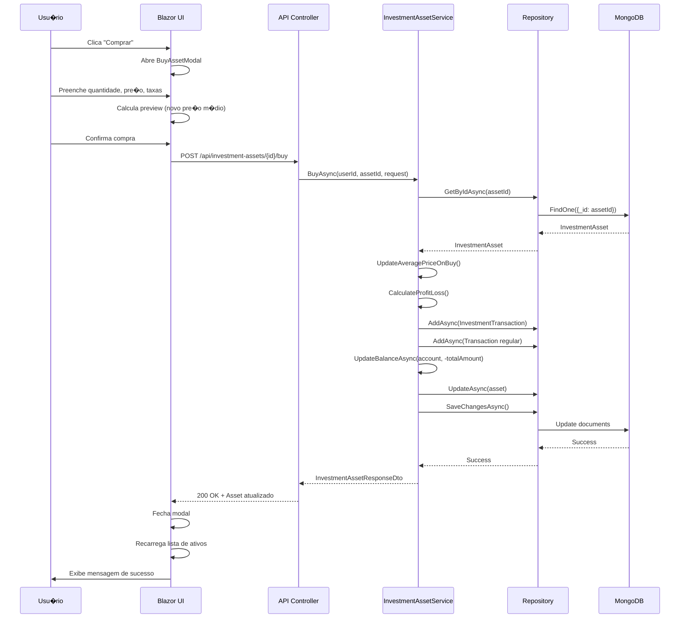
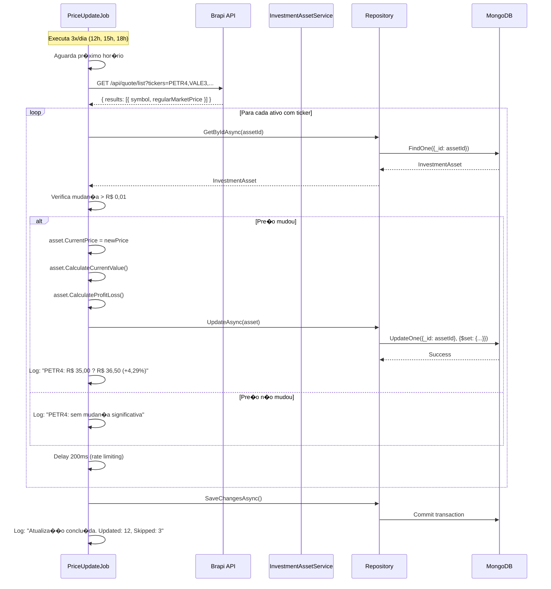

# Documentacao Tecnica - Sistema de Investimentos

## Status

Este modulo foi descontinuado e removido do sistema.

- Frontend, API, Application, Domain, Infrastructure e Worker relacionados a investimentos foram removidos.
- Jobs `InvestmentYieldProcessorJob` e `PriceUpdateJob` nao existem mais.
- Este documento permanece apenas como historico tecnico.

## Vis�o Geral

O m�dulo de **Gest�o de Investimentos** do MoneyManager permite que usu�rios registrem, acompanhem e gerenciem seus investimentos de forma completa, incluindo:

- M�ltiplos tipos de ativos (A��es, FIIs, Renda Fixa, Criptomoedas, Fundos, ETFs)
- Opera��es de compra e venda com c�lculo autom�tico de pre�o m�dio ponderado
- Registro de rendimentos (dividendos, juros, alugu�is)
- Ajustes de pre�os de mercado
- C�lculos autom�ticos de lucro/preju�zo e rentabilidade
- Relat�rios para an�lise e declara��o de IR
- Integra��o com API Brapi para cota��es autom�ticas (B3)
- Automa��o de rendimentos recorrentes

---

## ??? Arquitetura

### Estrutura em Camadas

```
???????????????????????????????????????????????????????????
?                  MoneyManager.Web (Blazor WASM)        ?
?  - P�ginas: Investments, InvestmentsDashboard, Reports ?
?  - Componentes: AssetCard, Modals, SummaryCard         ?
?  - Servi�os HTTP: InvestmentAssetService               ?
???????????????????????????????????????????????????????????
                            ? HTTP/REST
???????????????????????????????????????????????????????????
?            MoneyManager.Presentation (API)              ?
?  - Controllers: InvestmentAssets, Transactions, Reports?
?  - Autentica��o JWT                                     ?
?  - Valida��o de entrada                                 ?
???????????????????????????????????????????????????????????
                            ?
???????????????????????????????????????????????????????????
?           MoneyManager.Application (Servi�os)           ?
?  - InvestmentAssetService (l�gica de neg�cio)          ?
?  - InvestmentTransactionService                         ?
?  - InvestmentReportService                              ?
?  - MarketDataService (Brapi integration)                ?
???????????????????????????????????????????????????????????
                            ?
???????????????????????????????????????????????????????????
?        MoneyManager.Domain (Entidades & Regras)         ?
?  - InvestmentAsset (c�lculos autom�ticos)              ?
?  - InvestmentTransaction                                ?
?  - Enums: AssetType, TransactionType                   ?
???????????????????????????????????????????????????????????
                            ?
???????????????????????????????????????????????????????????
?      MoneyManager.Infrastructure (Reposit�rios)         ?
?  - InvestmentAssetRepository (MongoDB)                  ?
?  - InvestmentTransactionRepository                      ?
?  - UnitOfWork                                           ?
???????????????????????????????????????????????????????????
                            ?
???????????????????????????????????????????????????????????
?              MoneyManager.Worker (Jobs)                 ?
?  - InvestmentYieldProcessorJob (rendimentos di�rios)   ?
?  - PriceUpdateJob (cota��es 3x/dia: 12h, 15h, 18h)    ?
???????????????????????????????????????????????????????????
```

---

## ?? Modelo de Dados

### Diagrama de Entidades

```
???????????????????????????
?         User            ?
???????????????????????????
? + Id: string            ?
? + Email: string         ?
? + Name: string          ?
???????????????????????????
            ? 1
            ?
            ? *
???????????????????????????
?       Account           ?
???????????????????????????
? + Id: string            ?
? + UserId: string        ?
? + Name: string          ?
? + Type: AccountType     ?
? + Balance: decimal      ?
???????????????????????????
            ? 1
            ?
            ? *
???????????????????????????         1        *  ????????????????????????????
?   InvestmentAsset       ???????????????????????? InvestmentTransaction    ?
???????????????????????????                      ????????????????????????????
? + Id: string            ?                      ? + Id: string             ?
? + UserId: string        ?                      ? + UserId: string         ?
? + AccountId: string     ?                      ? + AssetId: string        ?
? + AssetType: enum       ?                      ? + AccountId: string      ?
? + Name: string          ?                      ? + TransactionType: enum  ?
? + Ticker: string?       ?                      ? + Quantity: decimal      ?
? + Quantity: decimal     ?                      ? + Price: decimal         ?
? + AveragePurchasePrice  ?                      ? + TotalAmount: decimal   ?
? + CurrentPrice: decimal ?                      ? + Fees: decimal          ?
? + TotalInvested: decimal?                      ? + Date: DateTime         ?
? + CurrentValue: decimal ?                      ? + Description: string    ?
? + ProfitLoss: decimal   ?                      ? + LinkedTransactionId    ?
? + ProfitLossPercentage  ?                      ????????????????????????????
? + LastPriceUpdate       ?                                 ?
? + Notes: string?        ?                                 ?
? + M�todos:              ?                                 ? 1
?   - CalculateCurrentValue()                               ?
?   - CalculateProfitLoss()                                 ? *
?   - UpdateAveragePriceOnBuy()                    ????????????????????????????
?   - UpdateAveragePriceOnSell()                   ?     Transaction          ?
?   - UpdateMarketPrice()                          ????????????????????????????
???????????????????????????                        ? + Id: string             ?
                                                    ? + UserId: string         ?
                                                    ? + AccountId: string      ?
                                                    ? + Type: TransactionType  ?
                                                    ? + Amount: decimal        ?
                                                    ? + Date: DateTime         ?
                                                    ? + Description: string    ?
                                                    ????????????????????????????
```

### Collections MongoDB

**InvestmentAssets:**
```json
{
  "_id": "asset_123",
  "UserId": "user_456",
  "AccountId": "acc_789",
  "AssetType": 0,
  "Name": "Petrobras PN",
  "Ticker": "PETR4",
  "Quantity": 100.0,
  "AveragePurchasePrice": 32.50,
  "CurrentPrice": 35.00,
  "TotalInvested": 3250.00,
  "CurrentValue": 3500.00,
  "ProfitLoss": 250.00,
  "ProfitLossPercentage": 7.69,
  "LastPriceUpdate": "2025-02-13T15:30:00Z",
  "Notes": "Primeira compra de a��es",
  "CreatedAt": "2025-01-15T10:00:00Z",
  "UpdatedAt": "2025-02-13T15:30:00Z",
  "IsDeleted": false
}
```

**InvestmentTransactions:**
```json
{
  "_id": "trans_123",
  "UserId": "user_456",
  "AssetId": "asset_123",
  "AccountId": "acc_789",
  "TransactionType": 0,
  "Quantity": 100.0,
  "Price": 32.50,
  "TotalAmount": 3260.00,
  "Fees": 10.00,
  "Date": "2025-01-15T10:00:00Z",
  "Description": "Compra inicial PETR4",
  "LinkedTransactionId": "regular_trans_456",
  "CreatedAt": "2025-01-15T10:00:00Z"
}
```

---

## ?? F�rmulas de C�lculo

### 1. Pre�o M�dio Ponderado (Compra)

Quando o usu�rio compra mais unidades de um ativo:

```
NovoPre�oM�dio = (ValorTotalInvestido + (NovaQuantidade � NovoPre�o) + Taxas) / (QuantidadeTotal + NovaQuantidade)
```

**Exemplo:**
- Possui: 100 a��es @ R$ 20,00 = R$ 2.000,00
- Compra: 50 a��es @ R$ 24,00 + R$ 5,00 taxas = R$ 1.205,00
- Novo Pre�o M�dio: (2.000 + 1.205) / 150 = **R$ 21,37**

**Implementa��o:**
```csharp
public void UpdateAveragePriceOnBuy(decimal quantity, decimal price, decimal fees)
{
    var newInvestment = (quantity * price) + fees;
    TotalInvested += newInvestment;
    Quantity += quantity;
    AveragePurchasePrice = Quantity > 0 ? TotalInvested / Quantity : 0;
    UpdatedAt = DateTime.UtcNow;
}
```

### 2. Pre�o M�dio Ponderado (Venda)

Na venda, o pre�o m�dio **n�o muda**, apenas reduz proporcionalmente:

```
NovoTotalInvestido = Pre�oM�dio � (QuantidadeTotal - QuantidadeVendida)
```

**Exemplo:**
- Possui: 150 a��es @ R$ 21,37 = R$ 3.205,00
- Vende: 50 a��es
- Novo Total Investido: 21,37 � 100 = **R$ 2.137,00**
- Pre�o M�dio: **R$ 21,37** (mant�m)

**Implementa��o:**
```csharp
public void UpdateAveragePriceOnSell(decimal quantity)
{
    if (quantity > Quantity)
        throw new InvalidOperationException("Quantidade insuficiente para venda");
    
    Quantity -= quantity;
    TotalInvested = AveragePurchasePrice * Quantity;
    UpdatedAt = DateTime.UtcNow;
}
```

### 3. Lucro/Preju�zo

```
Lucro/Preju�zo = ValorAtual - TotalInvestido
ValorAtual = Quantidade � Pre�oAtual
Percentual = (Lucro/Preju�zo / TotalInvestido) � 100
```

**Exemplo:**
- Possui: 100 a��es @ R$ 21,37 (m�dio) = R$ 2.137,00 investido
- Pre�o Atual: R$ 25,00
- Valor Atual: 100 � 25,00 = R$ 2.500,00
- Lucro: 2.500 - 2.137 = **R$ 363,00**
- Rentabilidade: (363 / 2.137) � 100 = **16,99%**

**Implementa��o:**
```csharp
public void CalculateProfitLoss()
{
    CalculateCurrentValue();
    ProfitLoss = CurrentValue - TotalInvested;
    ProfitLossPercentage = TotalInvested > 0 
        ? (ProfitLoss / TotalInvested) * 100 
        : 0;
}
```

### 4. Lucro/Preju�zo em Venda

Na opera��o de venda, calcula-se o resultado realizado:

```
ResultadoVenda = (Pre�oVenda - Pre�oM�dio) � QuantidadeVendida - Taxas
```

**Exemplo:**
- Vende: 50 a��es @ R$ 28,00 com R$ 10 de taxa
- Pre�o M�dio: R$ 21,37
- Resultado: (28 - 21,37) � 50 - 10 = **R$ 321,50** (lucro)

---

## ?? Endpoints da API

### Base URL
```
https://money-manager-api.up.railway.app/api
```

### Autentica��o
Todos os endpoints requerem autentica��o JWT via header:
```
Authorization: Bearer {token}
```

---

### InvestmentAssets Controller

#### 1. Listar Ativos
```http
GET /api/investment-assets
```

**Response 200 OK:**
```json
[
  {
    "id": "asset_123",
    "userId": "user_456",
    "accountId": "acc_789",
    "assetType": 0,
    "name": "Petrobras PN",
    "ticker": "PETR4",
    "quantity": 100.0,
    "averagePurchasePrice": 32.50,
    "currentPrice": 35.00,
    "totalInvested": 3250.00,
    "currentValue": 3500.00,
    "profitLoss": 250.00,
    "profitLossPercentage": 7.69,
    "lastPriceUpdate": "2025-02-13T15:30:00Z",
    "notes": "Primeira compra",
    "createdAt": "2025-01-15T10:00:00Z",
    "updatedAt": "2025-02-13T15:30:00Z"
  }
]
```

#### 2. Obter Ativo por ID
```http
GET /api/investment-assets/{id}
```

**Response 200 OK:** (mesmo formato acima)

**Response 404 Not Found:**
```json
{ "message": "Ativo de investimento n�o encontrado" }
```

#### 3. Criar Ativo
```http
POST /api/investment-assets
```

**Request Body:**
```json
{
  "accountId": "acc_789",
  "assetType": 0,
  "name": "Petrobras PN",
  "ticker": "PETR4",
  "initialQuantity": 100.0,
  "initialPrice": 32.50,
  "initialFees": 10.00,
  "notes": "Primeira compra de a��es"
}
```

**Response 201 Created:** (retorna o ativo criado)

#### 4. Atualizar Ativo
```http
PUT /api/investment-assets/{id}
```

**Request Body:**
```json
{
  "name": "Petrobras PN - Atualizado",
  "ticker": "PETR4",
  "notes": "Notas atualizadas"
}
```

**Response 200 OK:** (retorna o ativo atualizado)

#### 5. Deletar Ativo
```http
DELETE /api/investment-assets/{id}
```

**Response 204 No Content**

#### 6. Comprar Ativo
```http
POST /api/investment-assets/{id}/buy
```

**Request Body:**
```json
{
  "quantity": 50.0,
  "price": 35.00,
  "fees": 5.00,
  "date": "2025-02-13T10:00:00Z",
  "description": "Compra adicional"
}
```

**Response 200 OK:** (retorna o ativo com valores atualizados)

#### 7. Vender Ativo
```http
POST /api/investment-assets/{id}/sell
```

**Request Body:**
```json
{
  "quantity": 30.0,
  "price": 38.00,
  "fees": 5.00,
  "date": "2025-02-13T14:00:00Z",
  "description": "Realiza��o de lucro"
}
```

**Response 200 OK:** (retorna o ativo com valores atualizados)

#### 8. Ajustar Pre�o
```http
POST /api/investment-assets/{id}/adjust-price
```

**Request Body:**
```json
{
  "newPrice": 36.50,
  "date": "2025-02-13T15:30:00Z"
}
```

**Response 200 OK:** (retorna o ativo com novo pre�o)

#### 9. Obter Resumo
```http
GET /api/investment-assets/summary
```

**Response 200 OK:**
```json
{
  "totalInvested": 50000.00,
  "currentValue": 55000.00,
  "totalProfitLoss": 5000.00,
  "totalProfitLossPercentage": 10.00,
  "totalAssets": 5,
  "totalYields": 1500.00,
  "assetsByType": [
    {
      "assetType": 0,
      "count": 3,
      "totalInvested": 30000.00,
      "currentValue": 33000.00,
      "profitLoss": 3000.00,
      "profitLossPercentage": 10.00,
      "portfolioPercentage": 60.00
    }
  ],
  "topPerformers": [...],
  "worstPerformers": [...]
}
```

#### 10. Atualizar Pre�os (Manual)
```http
POST /api/investment-assets/update-prices
```

**Response 200 OK:**
```json
{
  "message": "Pre�os atualizados com sucesso",
  "updated": 12,
  "skipped": 2,
  "total": 14
}
```

---

### InvestmentTransactions Controller

#### 1. Listar Transa��es
```http
GET /api/investment-transactions?startDate=2025-01-01&endDate=2025-12-31
```

**Response 200 OK:**
```json
[
  {
    "id": "trans_123",
    "userId": "user_456",
    "assetId": "asset_123",
    "assetName": "Petrobras PN",
    "assetTicker": "PETR4",
    "accountId": "acc_789",
    "transactionType": 0,
    "quantity": 100.0,
    "price": 32.50,
    "totalAmount": 3260.00,
    "fees": 10.00,
    "date": "2025-01-15T10:00:00Z",
    "description": "Compra inicial",
    "linkedTransactionId": "regular_456",
    "createdAt": "2025-01-15T10:00:00Z"
  }
]
```

#### 2. Transa��es por Ativo
```http
GET /api/investment-transactions/asset/{assetId}
```

**Response 200 OK:** (mesmo formato acima)

#### 3. Registrar Rendimento
```http
POST /api/investment-transactions/yield
```

**Request Body:**
```json
{
  "assetId": "asset_123",
  "amount": 150.00,
  "yieldType": 2,
  "date": "2025-02-10T00:00:00Z",
  "description": "Dividendos PETR4"
}
```

**Response 200 OK:** (retorna a transa��o criada)

---

### InvestmentReports Controller

#### 1. Relat�rio de Vendas (IR)
```http
GET /api/investment-reports/sales/{year}
```

**Response 200 OK:**
```json
{
  "year": 2025,
  "sales": [
    {
      "date": "2025-02-13",
      "assetName": "Petrobras PN",
      "ticker": "PETR4",
      "quantity": 50.0,
      "averagePrice": 32.50,
      "salePrice": 38.00,
      "profitLoss": 275.00,
      "fees": 5.00,
      "taxDue": 41.25
    }
  ],
  "totalSold": 1900.00,
  "totalProfit": 275.00,
  "totalLoss": 0.00,
  "totalTaxDue": 41.25
}
```

#### 2. Relat�rio de Rendimentos
```http
GET /api/investment-reports/yields/{year}
```

**Response 200 OK:**
```json
{
  "year": 2025,
  "yields": [
    {
      "date": "2025-02-10",
      "assetName": "Petrobras PN",
      "ticker": "PETR4",
      "yieldType": "Dividend",
      "amount": 150.00
    }
  ],
  "totalYields": 1500.00,
  "totalDividends": 800.00,
  "totalInterest": 700.00
}
```

#### 3. Extrato Consolidado
```http
GET /api/investment-reports/consolidated?start=2025-01-01&end=2025-12-31
```

**Response 200 OK:**
```json
{
  "startDate": "2025-01-01",
  "endDate": "2025-12-31",
  "summary": {
    "totalInvested": 50000.00,
    "currentValue": 55000.00,
    "realizedProfitLoss": 500.00,
    "unrealizedProfitLoss": 4500.00,
    "totalYields": 1500.00
  },
  "transactions": [...]
}
```

---

## ?? Fluxos de Opera��o

### Fluxo de Compra de Ativo



### Fluxo de Atualiza��o Autom�tica de Pre�os



---

## ??? Decis�es Arquiteturais

### 1. Pre�o M�dio Ponderado vs FIFO/LIFO

**Decis�o:** Usar Pre�o M�dio Ponderado (Weighted Average Cost)

**Motivos:**
- ? Simplicidade de c�lculo e entendimento
- ? N�o requer rastreamento de lotes individuais
- ? Adequado para investidores pessoa f�sica no Brasil
- ? Facilita c�lculo de IR (n�o precisa especificar qual lote vendeu)

### 2. MongoDB vs SQL

**Decis�o:** MongoDB (j� usado no sistema)

**Motivos:**
- ? Esquema flex�vel para diferentes tipos de ativos
- ? Documentos aninhados (transactions dentro de assets)
- ? Escalabilidade horizontal
- ? Boa performance para leitura (dashboard)

### 3. API Externa para Cota��es

**Decis�o:** Brapi (https://brapi.dev)

**Motivos:**
- ? Gratuita e sem necessidade de API key
- ? Dados de a��es e FIIs da B3
- ? Boa documenta��o e confiabilidade
- ? Rate limit razo�vel

**Alternativas consideradas:**
- Yahoo Finance API (mais dados, mas rate limit menor)
- Alpha Vantage (requer API key)

### 4. Cache de Cota��es

**Decis�o:** In-Memory Cache (15 minutos)

**Motivos:**
- ? Simplicidade de implementa��o
- ? Reduz chamadas � API externa
- ? Suficiente para o caso de uso (cota��es atrasadas s�o aceit�veis)

**Alternativa:** Redis (para alta escala)

### 5. Worker Service vs Scheduler

**Decis�o:** BackgroundService (.NET)

**Motivos:**
- ? Nativo do .NET 9
- ? Auto-hospedado (n�o depende de servi�o externo)
- ? Controle fino sobre schedule
- ? Logs integrados

---

## ?? Troubleshooting

### Problema: Pre�os n�o atualizam automaticamente

**Poss�veis Causas:**
1. Worker Service n�o est� rodando
2. Ativo n�o tem ticker configurado
3. API Brapi est� indispon�vel

**Solu��o:**
```bash
# Verificar logs do Worker
docker logs money-manager-worker

# Testar atualiza��o manual
curl -X POST https://money-manager-api.up.railway.app/api/investment-assets/update-prices \
  -H "Authorization: Bearer {token}"

# Verificar disponibilidade da Brapi
curl https://brapi.dev/api/quote/PETR4
```

### Problema: Pre�o m�dio incorreto ap�s compra

**Poss�vel Causa:** Taxas n�o inclu�das no c�lculo

**Verifica��o:**
```csharp
// Verificar no banco
db.InvestmentAssets.findOne({_id: "asset_id"})

// Verificar c�lculo manual
TotalInvested = (QuantidadeAnterior � Pre�oM�dioAnterior) + (NovaQuantidade � NovoPre�o) + Taxas
NovoPre�oM�dio = TotalInvested / (QuantidadeAnterior + NovaQuantidade)
```

### Problema: Saldo da conta n�o atualiza ap�s opera��o

**Poss�vel Causa:** Transa��o n�o foi criada ou falhou

**Verifica��o:**
```bash
# Verificar transa��es vinculadas
db.Transactions.find({LinkedTransactionId: {$exists: true}})

# Verificar saldo da conta
db.Accounts.findOne({_id: "account_id"})
```

**Solu��o:**
```csharp
// Reprocessar opera��o com logs
_logger.LogInformation("Saldo anterior: {Balance}", account.Balance);
await _accountService.UpdateBalanceAsync(userId, accountId, amount);
_logger.LogInformation("Saldo posterior: {Balance}", account.Balance);
```

### Problema: Worker executa m�ltiplas vezes no mesmo hor�rio

**Poss�vel Causa:** M�ltiplas inst�ncias do Worker rodando

**Solu��o:**
```bash
# Verificar inst�ncias
docker ps | grep money-manager-worker

# Parar duplicatas
docker stop {container_id}

# Verificar vari�vel de ambiente
WORKER_ENABLED=true  # Apenas em uma inst�ncia
```

---

## ?? M�tricas e Monitoramento

### Logs Importantes

**InvestmentAssetService:**
```
[INFO] Creating investment asset for user user_123: Petrobras PN
[INFO] Investment asset asset_456 created successfully
[INFO] Processing buy operation for asset asset_456, quantity: 50, price: 35.00
[INFO] Buy operation completed. New quantity: 150, New avg price: 33.50
```

**PriceUpdateJob:**
```
[INFO] Pr�xima atualiza��o de pre�os agendada para: 13/02/2025 15:00:00
[INFO] Iniciando atualiza��o de pre�os �s 15:00:00
[INFO] Encontrados 12 ativos com ticker para atualizar
[INFO] Pre�o atualizado: PETR4 - De R$ 35,00 para R$ 36,50 (+4,29%)
[INFO] Atualiza��o de pre�os conclu�da. Atualizados: 10, Pulados: 2, Erros: 0
```

### Performance Benchmarks

| Opera��o | Tempo M�dio | M�ximo Aceit�vel |
|----------|-------------|------------------|
| Listar ativos (10 itens) | 50ms | 200ms |
| Criar ativo | 80ms | 300ms |
| Comprar/Vender | 120ms | 500ms |
| Obter resumo | 200ms | 1s |
| Atualizar pre�os (10 ativos) | 2s | 10s |
| Gerar relat�rio anual | 500ms | 2s |

---

## ?? Seguran�a

### Autentica��o e Autoriza��o

**Valida��es Implementadas:**
1. ? JWT obrigat�rio em todos os endpoints
2. ? UserId extra�do do token (n�o aceito via par�metro)
3. ? Verifica��o de propriedade (asset.UserId == authenticatedUserId)
4. ? Soft delete (dados nunca s�o realmente deletados)

### Valida��es de Neg�cio

**InvestmentAssetService:**
- ? Quantidade de venda n�o pode exceder quantidade possu�da
- ? Pre�o n�o pode ser negativo (validado na entidade)
- ? Conta deve ser do tipo Investment
- ? Ativo deve pertencer ao usu�rio autenticado

---

## ?? Refer�ncias

- [Documenta��o .NET 9](https://docs.microsoft.com/dotnet)
- [Blazor WebAssembly](https://docs.microsoft.com/aspnet/core/blazor)
- [MongoDB Driver .NET](https://mongodb.github.io/mongo-csharp-driver)
- [Brapi API](https://brapi.dev/docs)
- [Chart.js](https://www.chartjs.org/docs)

---

## ?? Suporte

Para d�vidas t�cnicas ou reportar bugs:
- **Email:** suporte@moneymanager.com
- **GitHub Issues:** https://github.com/lgfauth/money-manager/issues
- **Documenta��o:** https://docs.moneymanager.com

---

**�ltima atualiza��o:** 13/02/2025
**Vers�o do sistema:** 1.0.0
